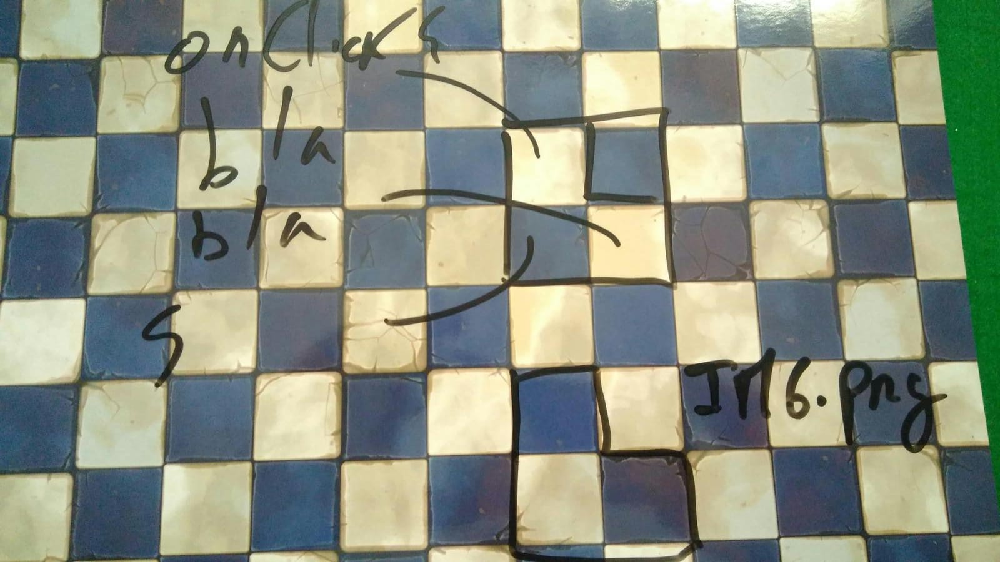
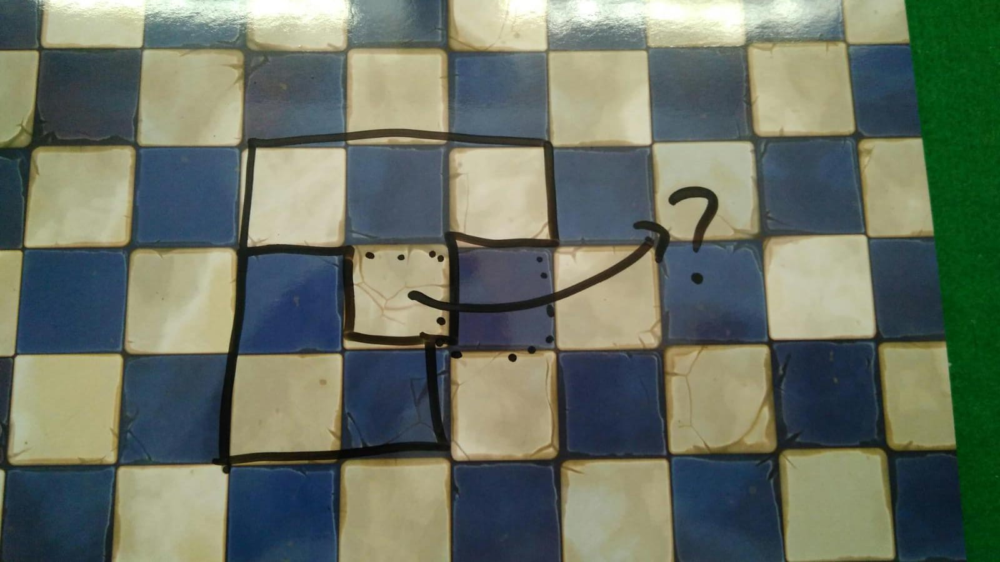

# react-jus

The component I'm trying to reproduce looks like
https://youtu.be/fMrXHPdFsCM?t=806 with support for drag & drop.

Think about it as a puzzle, or Tetris. The component has two parts: a grid of squares, and elements (pieces) composed from squares that can be dragged into the grid. The pieces cannot be dropped in spaces where there's already an element below.

The pieces can be any combination of connected squares, from 1 to any number of squares, in any shape. They behave like containers that can be styled. See the original examples: https://imgur.com/PCW0Oc9

The grid/piece squares can be of an arbitrary size in pixels, and also can be styled individually.

Both the drag preview and the drop point can be styled, as already supported by react-dnd. The pieces snap to the grid, and cannot be dropped outside it or where there's already a piece.

## Technology stack
Yarn + vanilla React + react-dnd
Typescript if possible

## Methodology
Send PRs with a feature branch
Incrementar PRs go against a branch
PRs are reviewed and merged into the branch, and then squashed into main

## Specifications

### Grid
Use https://react-dnd.github.io/react-dnd/examples/drag-around/custom-drag-layer and https://react-dnd.github.io/react-dnd/examples/tutorial as a reference. There is an invisible grid where components can be dropped.

The grid component will receive props like:

```js
{
  rows: number, // total rows in the grid
  columns: number, // total columns on the grid
  sizePx: number, // width and height of each square in the grid
  children: {
    positions: { // OPTION A: squares in the grid occupied by this children
    x: number,
    y: number,
    }[],
    position: {  // OPTION B: paint-by-numbers array, i.e. a 2x2 L shape would be
    //  [
    //    [1, 0],
    //    [1, 1],
    //  ]
      x: number,
      y: number,
      shape: number[][]
    }
    component: ReactComponent, // the children itself
  }[],
  style // including background
  ... // other: TBD
}
```

A `<div>` will have each children component laid out internally using its x and y, and sizePx.

Children will _not_ be validated that they don't overlap. That logic will only apply for drag/drop.

### Children
Each children will contain a single React component, overlayed by an invisible grid for DnD interactions. There are two options for the grid: `flexbox` or `div`. In either option you will need to have a composition of squares (div?) that'll receive drag events individually.



This division is necessary to allow passthrough of events where two children representations will overlap.



### Drag & Drop
Use https://react-dnd.github.io/react-dnd/examples/nesting/drag-sources as a reference. The sources are in https://github.com/react-dnd/react-dnd/blob/main/packages/examples-hooks/src/03-nesting/drag-sources/SourceBox.tsx

Each square in a children in the grid can be dragged individually, and will be considered the anchor when dropped. You cannot start a drag anywhere in the grid where there isn't a children.

As the user is hovering over the grid, it will highlight the squares that the children will be placed in. In red are those where the children would overlap with others. In green empty spaces where the piece will fall. Note that this is _not_ calculating all possible positions, just for the one where the user is hovering over.

You cannot drop a children where one of its squares it would overlap with other children. My suggestion is to keep a State array that tracks the children components.

You cannot drop a children outside the grid area. You can _start_ a drag outside the grid area, bringing in the new children. If the new children isn't dropped in a valid position it disappears.
